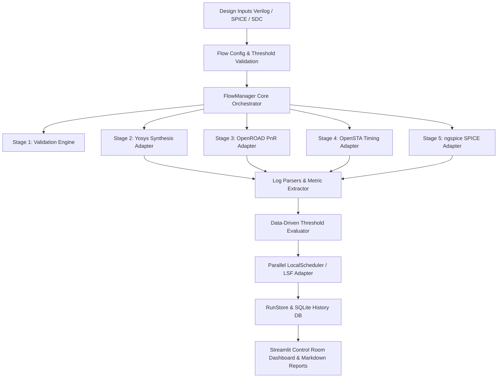

# PHYFlow — EDA Automation & Custom-Cell Validation Framework

[](https://github.com/Dhanya562004/phyflow-eda-automation/actions)
[](https://www.python.org/downloads/)
[](LICENSE)
[](https://streamlit.io/)

**PHYFlow** is a modular Python software engineering framework that orchestrates repeatable Electronic Design Automation (EDA) workflows for digital logic designs and educational custom-cell physical IP validation. 

Designed with clean object-oriented architecture, PHYFlow integrates open-source EDA toolchains (**Yosys**, **OpenROAD**, **OpenSTA**, and **ngspice**), automates Tcl/Bash execution, handles bounded parallel regression matrices across PVT process corners, and provides persistent run metadata storage and interactive engineering dashboards.

---

## Architecture Diagram



---

## Table of Contents

1. [Problem](#1-problem)
2. [Why PHYFlow](#2-why-phyflow)
3. [Architecture](#3-architecture)
4. [EDA Workflow](#4-eda-workflow)
5. [Supported Tools](#5-supported-tools)
6. [Custom-Cell Validation](#6-custom-cell-validation)
7. [Parallel Execution](#7-parallel-execution)
8. [Scheduler Design](#8-scheduler-design)
9. [Tcl & Bash Automation](#9-tcl--bash-automation)
10. [Regression Testing](#10-regression-testing)
11. [Failure Handling](#11-failure-handling)
12. [Result Parsing](#12-result-parsing)
13. [Run Artifacts](#13-run-artifacts)
14. [CLI Commands](#14-cli-commands)
15. [Streamlit Dashboard](#15-streamlit-dashboard)
16. [Demo Mode vs Real EDA Mode](#16-demo-mode-vs-real-eda-mode)
17. [Linux Setup](#17-linux-setup)
18. [Docker Setup](#18-docker-setup)
19. [Installation](#19-installation)
20. [Testing](#20-testing)
21. [CI/CD](#21-cicd)
22. [Limitations](#22-limitations)
23. [Future Work](#23-future-work)
24. [License](#24-license)

---

## 1. Problem

In physical IP and digital design enablement workflows, silicon validation requires orchestrating multiple heterogeneous tools across various design entry formats (RTL Verilog, Liberty models, LEF physical macros, and SPICE netlists). Running these flows manually leads to non-reproducible run artifacts, unmonitored timing slack violations, lack of parallel execution capabilities, and difficult failure diagnostics.

## 2. Why PHYFlow

PHYFlow solves this challenge by delivering an object-oriented Python framework that decouples tool command invocation from business logic:
- **Clean OOP Tool Adapters:** Tool execution is handled via specialized subclasses (`ToolAdapter`) rather than monolithic scripts.
- **Data-Driven Validation:** Quantitative thresholds evaluate Worst Negative Slack (WNS), total silicon area, core utilization, and SPICE transient delay measurements.
- **Concurrent Regression Matrix:** Runs designs across process corners (**SS**, **TT**, **FF**) concurrently using `concurrent.futures`.
- **Dual Execution Engine:** Supports native Linux EDA toolchain execution and a Streamlit Cloud demo mode utilizing verified reference run artifacts.

---

## 3. Architecture

The codebase follows strict single-responsibility separation:

```
phyflow-eda-automation/
├── phyflow/
│   ├── cli.py               # ArgParse Command Line Interface
│   ├── config.py            # Strongly typed FlowConfig loader
│   ├── models.py            # Dataclasses & Enums (Design, Job, Corner, Metrics)
│   ├── flow/                # FlowManager & 8-stage execution graph
│   ├── tools/               # Base ToolAdapter, Yosys, OpenROAD, OpenSTA, ngspice
│   ├── execution/           # Subprocess command runner, LocalScheduler, LSF adapter
│   ├── parsers/             # Regex & structured log parsers
│   ├── validation/          # FlowValidator & regression evaluator
│   ├── storage/             # RunStore & SQLite metadata persistence
│   ├── reporting/           # Markdown report generator & summary formatters
│   └── utils/               # File system, logging, tool detection
├── designs/                 # Catalog: inverter, nand2, nor2, xor2, mux2, alu
├── libs/                    # SkyWater 130nm Liberty (.lib), LEF, and SPICE models
├── scripts/                 # Automated Tcl scripts and POSIX Bash runner
├── configs/                 # YAML flow configurations
├── tests/                   # Pytest suite (Unit, Integration, Regression)
├── demo_artifacts/          # Checked-in reference run artifacts for cloud demo
├── dashboard/               # Streamlit engineering control room
├── Dockerfile, Makefile     # Reproducible environment setup
└── pyproject.toml           # Python package build specifications
```

---

## 4. EDA Workflow

Every design run progresses through an 8-stage pipeline:

| Stage | Name | Description | EDA Tool |
|---|---|---|---|
| 1 | `VALIDATION` | Verifies Verilog/SPICE source files and SDC constraints | Python Validator |
| 2 | `SYNTHESIS` | RTL elaboration, optimization, and technology mapping | Yosys |
| 3 | `FLOORPLAN` | Core utilization setup and IO pin placement | OpenROAD |
| 4 | `PLACE_ROUTE` | Standard cell placement and signal routing | OpenROAD |
| 5 | `STA` | Static Timing Analysis & slack calculation | OpenSTA |
| 6 | `SPICE_VALIDATION` | Transistor-level SPICE transient simulation | ngspice |
| 7 | `PARSING & THRESHOLD` | Parses metrics and enforces data-driven constraints | FlowValidator |
| 8 | `REPORTING` | Generates summary reports and updates SQLite history DB | RunStore |

---

## 5. Supported Tools

PHYFlow integrates standard open-source EDA tools:
- **Yosys (v0.33+):** RTL Verilog synthesis and gate mapping.
- **OpenROAD (v2.0+):** Physical design placement and routing.
- **OpenSTA (v2.4+):** Static timing analysis.
- **ngspice (v39+):** SPICE circuit simulation.
- **Tcl & Bash:** Scripting engine for tool commands and flow wrapper.

Audit tool availability on your machine using:
```bash
phyflow check-tools
```

---

## 6. Custom-Cell Validation

For custom physical IP cells (`inverter`, `nand2`, `nor2`), PHYFlow executes transistor-level SPICE transient analysis using **ngspice** to measure:
- **Logic Correctness:** Verifies output high ($V_{OH} \ge 1.4V$) and low ($V_{OL} \le 0.4V$).
- **Rise Delay ($t_{rise}$):** 10% to 90% output voltage transition time.
- **Fall Delay ($t_{fall}$):** 90% to 10% output voltage transition time.
- **SPICE Convergence:** Catches non-convergent matrix solving or timestep failures.

---

## 7. Parallel Execution

PHYFlow includes a thread-safe parallel scheduler (`LocalScheduler`) that executes design/corner combinations concurrently:

```bash
phyflow regression --config configs/regression.yaml --workers 4
```

Results across worker threads are collected deterministically without race conditions during SQLite database updates.

---

## 8. Scheduler Design

The framework abstracts job execution via `BaseScheduler`:
- **LocalScheduler:** Multithreaded execution using `concurrent.futures.ThreadPoolExecutor`.
- **LSFCommandAdapter:** Provides an IBM Spectrum LSF (`bsub`) compatible submission interface for demonstrating HPC cluster batch scheduling concepts.

*Note: LSF script generation demonstrates cluster batch submission abstractions; native execution uses LocalScheduler.*

---

## 9. Tcl & Bash Automation

Tcl scripts in `scripts/` automate EDA tool passes:
- `run_synthesis.tcl`: Configures Yosys elaboration and library mapping.
- `run_floorplan.tcl` & `run_place_route.tcl`: Configures OpenROAD floorplanning and routing.
- `run_sta.tcl`: Configures OpenSTA timing constraints.
- `scripts/regression.sh`: POSIX shell wrapper for regression execution.

Makefile targets:
```bash
make check-tools
make test
make regression
make demo
```

---

## 10. Regression Testing

Run the full matrix across all 6 designs (`inverter`, `nand2`, `nor2`, `xor2`, `mux2`, `alu`) and 3 PVT process corners (`SS`, `TT`, `FF`):

```bash
phyflow regression --workers 4
```

---

## 11. Failure Handling

PHYFlow classifies execution errors into strongly typed `FailureType` enums:
- `TOOL_NOT_FOUND`: Executable missing from PATH.
- `PROCESS_FAILURE`: Tool returned a non-zero exit code.
- `TIMEOUT`: Execution exceeded timeout threshold.
- `VALIDATION_FAILURE`: WNS, Area, or SPICE metrics violated thresholds.
- `SPICE_FAILURE`: Transient simulation convergence failure.

---

## 12. Result Parsing

Robust regex parsers in `phyflow/parsers/` extract metrics from raw stdout:
- **Yosys Parser:** Cell count, total area ($\mu m^2$), gate breakdown.
- **OpenROAD Parser:** Placement density, routed wire length ($um$), DRC violations.
- **OpenSTA Parser:** WNS ($ns$), TNS ($ns$), critical path endpoint.
- **ngspice Parser:** Rise delay ($ps$), fall delay ($ps$), $V_{OH}$, $V_{OL}$.

---

## 13. Run Artifacts

Each run generates structured directory outputs in `runs/<run_id>/`:
```
runs/inverter_tt/
├── metadata.json
├── results.json
├── logs/
│   ├── synthesis.log
│   ├── place_route.log
│   ├── sta.log
│   └── ngspice.log
├── reports/
│   └── summary_report.md
└── artifacts/
```

Run metadata is simultaneously synced to SQLite at `runs/phyflow_history.db`.

---

## 14. CLI Commands

```bash
# Audit toolchain environment
phyflow check-tools

# Run flow for single design
phyflow run --design inverter --corner tt

# Run design across all PVT corners
phyflow run --design inverter --all-corners

# Execute parallel regression
phyflow regression --workers 4

# List historical runs in SQLite DB
phyflow list-runs

# Inspect specific run details
phyflow inspect --run-id inverter_tt

# Display Markdown report
phyflow report --run-id inverter_tt

# Clean run artifacts
phyflow clean
```

---

## 15. Streamlit Dashboard

Launch the Streamlit Engineering Control Room:
```bash
streamlit run dashboard/app.py
```

Features:
- Executive status metrics & pass rate.
- Interactive PVT Corner WNS Slack charts (Plotly).
- Custom-cell SPICE transient waveform visualization.
- Multi-corner regression matrix table.
- Raw EDA log viewer.
- CLI flow execution trigger.

---

## 16. Demo Mode vs Real EDA Mode

PHYFlow automatically detects available binaries:
- **Mode A (Local Real EDA Mode):** Invokes actual EDA tools via subprocess when binaries are present in PATH.
- **Mode B (Deployed Demo / Artifact Mode):** Uses checked-in reference artifacts in `demo_artifacts/` when running in hosted environments like Streamlit Community Cloud without EDA binaries.

The UI clearly indicates the active execution mode.

---

## 17. Linux Setup

On Ubuntu / Debian systems:
```bash
sudo apt-get update
sudo apt-get install -y python3 python3-pip tcl tcl-dev bash yosys ngspice
```

---

## 18. Docker Setup

Build and run reproducible Linux EDA container:
```bash
docker build -t phyflow:latest .
docker run --rm -it phyflow:latest phyflow check-tools
```

---

## 19. Installation

Clone and install in editable mode:
```bash
git clone https://github.com/Dhanya562004/phyflow-eda-automation.git
cd phyflow-eda-automation
pip install -e .
```

---

## 20. Testing

Run Pytest unit, integration, and regression test suite:
```bash
pytest -v tests/
```

---

## 21. CI/CD

GitHub Actions workflow `.github/workflows/ci.yml` automatically validates syntax, runs unit/integration tests, and verifies CLI regression commands on every push to `main`.

---

## 22. Limitations

- Academic SkyWater 130nm Liberty/LEF models are simplified for educational validation.
- Physical routing in OpenROAD requires Docker/Linux environment for full DRC checks.

---

## 23. Future Work

- GDSII stream extraction and DRC/LVS integration via KLayout.
- Power estimation via Synopsys Liberty SAIF/VCD toggle rate parsing.

---

## 24. License

This project is licensed under the MIT License. See [LICENSE](LICENSE) for details.
