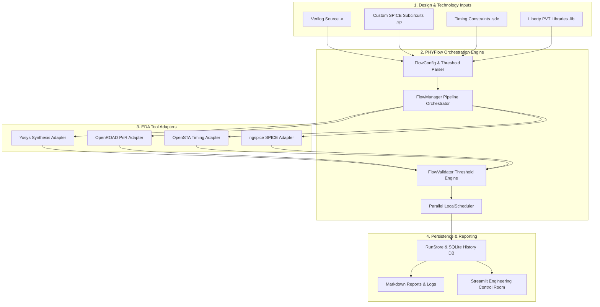
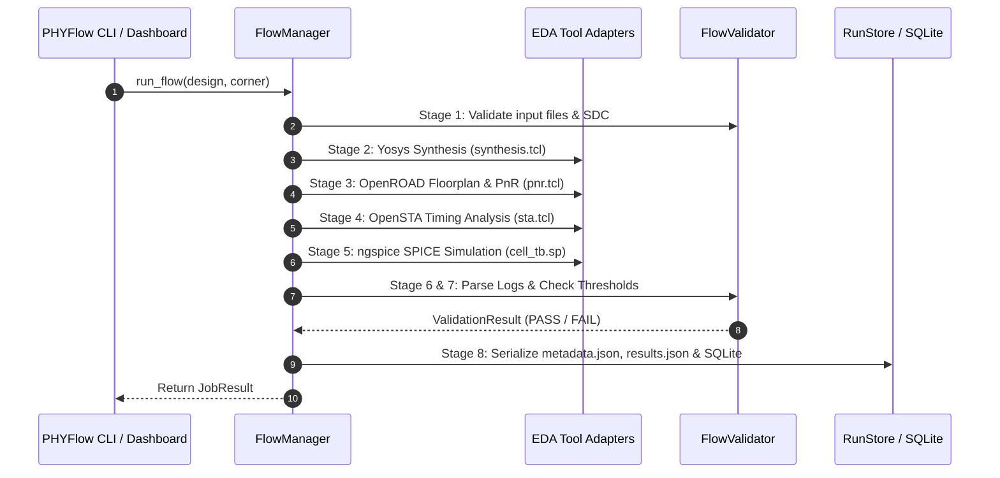

# PHYFlow — EDA Automation & Custom-Cell Validation Framework

<div align="center">

[](https://share.streamlit.io)
[](https://github.com/Dhanya562004/phyflow-eda-automation/actions)
[](https://www.python.org/downloads/)
[](tests/)
[](LICENSE)

**An production-grade Python engineering framework for physical IP enablement, automated EDA toolchain orchestration, parallel PVT corner regression testing, and transistor-level SPICE validation.**

[Live Dashboard](https://share.streamlit.io) • [Architecture](#3-architecture) • [CLI Reference](#14-cli-command-reference) • [Docker Setup](#18-docker-setup) • [Deployment](#16-demo-mode-vs-real-eda-mode)

</div>

---

## ⚡ System Architecture



---

## 📌 Executive Summary

**PHYFlow** bridges software engineering best practices with Electronic Design Automation (EDA) and physical IP validation workflows. It provides a modular, object-oriented automation layer over standard open-source semiconductor toolchains (**Yosys**, **OpenROAD**, **OpenSTA**, and **ngspice**).

> [!IMPORTANT]
> **Portfolio Context:** Built to model real-world Physical IP / Design Enablement workflows. PHYFlow separates tool execution into reusable adapters (`ToolAdapter`), enforces data-driven quality thresholds, captures structured run telemetry, and provides dual execution engines for local workstations, Docker containers, and cloud deployments like Streamlit Community Cloud.

---

## 📑 Table of Contents

1. [Problem Statement](#1-problem-statement)
2. [Why PHYFlow](#2-why-phyflow)
3. [Architecture & Design System](#3-architecture--design-system)
4. [Supported EDA Toolchain](#4-supported-eda-toolchain)
5. [Design Catalog](#5-design-catalog)
6. [8-Stage EDA Pipeline](#6-8-stage-eda-pipeline)
7. [Custom-Cell SPICE Validation](#7-custom-cell-spice-validation)
8. [Parallel Regression Scheduler](#8-parallel-regression-scheduler)
9. [HPC LSF Scheduler Abstraction](#9-hpc-lsf-scheduler-abstraction)
10. [Tcl & POSIX Shell Automation](#10-tcl--posix-shell-automation)
11. [Data-Driven Validation Engine](#11-data-driven-validation-engine)
12. [Structured Result Parsers](#12-structured-result-parsers)
13. [Run Artifacts & Telemetry](#13-run-artifacts--telemetry)
14. [CLI Command Reference](#14-cli-command-reference)
15. [Streamlit Engineering Dashboard](#15-streamlit-engineering-dashboard)
16. [Demo Mode vs Real EDA Mode](#16-demo-mode-vs-real-eda-mode)
17. [Linux Setup](#17-linux-setup)
18. [Docker Setup](#18-docker-setup)
19. [Installation](#19-installation)
20. [Testing Suite](#20-testing-suite)
21. [CI/CD Engine](#21-cicd-engine)
22. [Limitations](#22-limitations)
23. [Future Enhancements](#23-future-enhancements)
24. [License](#24-license)

---

## 1. Problem Statement

Semiconductor design enablement requires executing multi-step tool pipelines across varied design formats (Verilog RTL, Liberty `.lib` files, LEF physical layouts, and SPICE netlists). Running these flows manually or via unstructured shell scripts creates significant engineering friction:
- Non-reproducible run logs and unversioned run artifacts.
- Undetected Worst Negative Slack (WNS) timing violations across Process, Voltage, and Temperature (PVT) corners.
- Lack of parallel worker pool scheduling for multi-design regressions.
- Opaque tool failure modes without structured error classification.

---

## 2. Why PHYFlow

PHYFlow solves these challenges by treating EDA orchestration as a software engineering domain:

- 🧱 **Clean OOP Tool Adapters:** Subclassed `ToolAdapter` execution modules isolate subprocess handling, stream redirection, duration logging, and exit code capture.
- 🎯 **Data-Driven Threshold Validation:** Configurable quantitative constraints enforce timing slack ($WNS \ge 0.0\text{ ns}$), silicon area limits, placement density, and SPICE transient delay criteria.
- ⚡ **Parallel Multithreaded Scheduler:** `LocalScheduler` leverages bounded `concurrent.futures.ThreadPoolExecutor` thread pools to run regression matrices concurrently across PVT process corners (**SS**, **TT**, **FF**).
- 📊 **Streamlit Control Room:** Interactive engineering dashboard displaying PVT slack line charts, custom-cell SPICE transient waveforms, pass/fail regression heatmaps, and raw stage logs.
- ☁️ **Dual Execution Architecture:** Native execution on Linux EDA environments and Mode B artifact analysis on cloud hosts like Streamlit Community Cloud.

---

## 3. Architecture & Design System

The repository strictly enforces single-responsibility module separation:

```
phyflow-eda-automation/
├── phyflow/
│   ├── cli.py               # ArgParse Command Line Interface
│   ├── config.py            # Strongly-typed FlowConfig & YAML loader
│   ├── models.py            # Dataclasses & Enums (Design, Job, Corner, Metrics)
│   ├── flow/                # FlowManager orchestrator & stage definitions
│   ├── tools/               # Base ToolAdapter, Yosys, OpenROAD, OpenSTA, ngspice
│   ├── execution/           # Command runner, LocalScheduler, LSF bsub adapter
│   ├── parsers/             # Regex log parsers (Yosys, OpenROAD, OpenSTA, ngspice)
│   ├── validation/          # FlowValidator threshold engine & regression builder
│   ├── storage/             # RunStore & SQLite metadata persistence
│   ├── reporting/           # Markdown report generator & summary formatters
│   └── utils/               # Path resolution, logging, tool detection
├── designs/                 # Design inputs: inverter, nand2, nor2, xor2, mux2, alu
├── libs/                    # SkyWater 130nm Liberty (.lib), LEF, & SPICE models
├── scripts/                 # Automated Tcl scripts & POSIX Bash regression runner
├── configs/                 # YAML flow configurations (default, fast, regression)
├── tests/                   # Pytest suite (Unit, Integration, Regression)
├── demo_artifacts/          # Checked-in reference run artifacts across 18 PVT runs
├── dashboard/               # Streamlit control room application
├── Dockerfile, Makefile     # Docker & Makefile build targets
└── pyproject.toml           # Python package build configuration
```

---

## 4. Supported EDA Toolchain

| Tool | Domain | Version Flag | Functionality |
|---|---|---|---|
| **Yosys** | RTL Logic Synthesis | `yosys -V` | Gate elaboration, boolean optimization, technology mapping |
| **OpenROAD** | Physical PnR | `openroad -version` | Floorplanning, IO placement, cell placement, signal routing |
| **OpenSTA** | Static Timing Analysis | `opensta -version` | Propagation delay calculation, WNS/TNS slack reporting |
| **ngspice** | Circuit Simulation | `ngspice -v` | Transistor-level SPICE transient analysis ($t_{rise}$, $t_{fall}$) |
| **Tcl & POSIX Shell** | Automation | `tclsh`, `bash` | Process orchestration and script execution wrapper |

Audit local tool availability using:
```bash
phyflow check-tools
```

---

## 5. Design Catalog

PHYFlow includes educational digital logic designs and custom physical IP cells:

| Design Name | Design Type | Top Module | Custom SPICE Validation | Primary Verification Target |
|---|---|---|---|---|
| `inverter` | `CUSTOM_CELL` | `inverter` | ✅ `inverter_tb.sp` | Single-stage CMOS inverter delay & $V_{OH}/V_{OL}$ |
| `nand2` | `CUSTOM_CELL` | `nand2` | ✅ `nand2_tb.sp` | 2-Input NAND gate transient delay & logic verification |
| `nor2` | `CUSTOM_CELL` | `nor2` | ✅ `nor2_tb.sp` | 2-Input NOR gate transient delay & logic verification |
| `xor2` | `RTL` | `xor2` | — | 2-Input XOR gate synthesis & STA slack |
| `mux2` | `RTL` | `mux2` | — | 2:1 Multiplexer physical layout & utilization |
| `alu` | `RTL` | `alu` | — | 4-bit Arithmetic Logic Unit synthesis & multi-corner STA |

---

## 6. 8-Stage EDA Pipeline



---

## 7. Custom-Cell SPICE Validation

For custom-cell physical IP (`inverter`, `nand2`, `nor2`), PHYFlow executes transistor-level SPICE transient simulations using **ngspice** to measure:

- **Logic Thresholds:** Verifies high ($V_{OH} \ge 1.4\text{V}$) and low ($V_{OL} \le 0.4\text{V}$) voltage levels.
- **Propagation Rise Delay ($t_{rise}$):** 50% input to 50% output rising edge transition time.
- **Propagation Fall Delay ($t_{fall}$):** 50% input to 50% output falling edge transition time.
- **Convergence Checks:** Catches non-convergent matrix solving or timestep failures.

---

## 8. Parallel Regression Scheduler

PHYFlow features a thread-safe parallel scheduler (`LocalScheduler`) that executes design/corner combinations concurrently:

```bash
phyflow regression --config configs/regression.yaml --workers 4
```

> [!TIP]
> **Deterministic Result Aggregation:** Thread pool futures are collected as they complete, but final results are sorted deterministically based on input matrix order before writing to SQLite and generating reports.

---

## 9. HPC LSF Scheduler Abstraction

For High-Performance Computing (HPC) cluster environments, `LSFCommandAdapter` generates IBM Spectrum LSF (`bsub`) batch submission scripts:

```bash
# Generated LSF Batch Submission Script
bsub -J inverter_tt -q normal -n 4 -R "rusage[mem=4096]" -o inverter_tt_%J.log \
  "phyflow run --design inverter --corner tt"
```

*Note: LSF script generation demonstrates cluster batch submission abstractions; native execution uses LocalScheduler.*

---

## 10. Tcl & POSIX Shell Automation

- `scripts/run_synthesis.tcl`: Configures Yosys elaboration and library mapping.
- `scripts/run_floorplan.tcl`: Configures OpenROAD floorplanning and IO pin placement.
- `scripts/run_place_route.tcl`: Configures OpenROAD cell placement and routing.
- `scripts/run_sta.tcl`: Configures OpenSTA timing constraints.
- `scripts/regression.sh`: POSIX shell wrapper for regression execution.

Makefile Automation Targets:
```bash
make check-tools   # Verify toolchain availability
make test          # Execute pytest suite
make regression    # Run parallel regression suite
make demo          # Launch Streamlit dashboard
make docker-build  # Build Docker container
make clean         # Clean temporary run artifacts
```

---

## 11. Data-Driven Validation Engine

Quantitative constraints are loaded from YAML configuration files:

```yaml
thresholds:
  min_wns_ns: 0.0          # Worst Negative Slack threshold
  min_tns_ns: 0.0          # Total Negative Slack threshold
  max_area_um2: 50000.0    # Maximum silicon area limit
  max_utilization_pct: 85.0 # Maximum core utilization percentage
  require_spice_convergence: true
  max_rise_delay_ps: 200.0
  max_fall_delay_ps: 200.0
```

`FlowValidator` evaluates parsed metrics against these criteria and returns a structured `ValidationResult` containing specific violation diagnostics.

---

## 12. Structured Result Parsers

Dedicated regex parsers in `phyflow/parsers/` extract metrics from tool logs:

- **Yosys Parser:** Gate count, cell area ($\mu m^2$), cell breakdown dictionary.
- **OpenROAD Parser:** Core utilization percentage, total wire length ($\mu m$), DRC violations.
- **OpenSTA Parser:** WNS ($ns$), TNS ($ns$), critical path endpoint, violation counts.
- **ngspice Parser:** Rise delay ($ps$), fall delay ($ps$), $V_{OH}$, $V_{OL}$, convergence status.

---

## 13. Run Artifacts & Telemetry

Each flow run creates a self-contained output directory:

```
runs/inverter_tt/
├── metadata.json          # Run ID, timestamp, tool versions, execution mode
├── results.json           # Parsed metrics, validation result, error details
├── logs/
│   ├── synthesis.log      # Captured Yosys stdout/stderr
│   ├── place_route.log    # Captured OpenROAD stdout/stderr
│   ├── sta.log            # Captured OpenSTA stdout/stderr
│   └── ngspice.log        # Captured ngspice stdout/stderr
└── reports/
    └── summary_report.md  # Human-readable Markdown summary report
```

All run telemetry is synced to a SQLite database (`runs/phyflow_history.db`).

---

## 14. CLI Command Reference

```bash
# 1. Audit system and EDA tool availability
phyflow check-tools

# 2. Run EDA flow for a single design (TT corner)
phyflow run --design inverter --corner tt

# 3. Run design across all process corners (SS, TT, FF)
phyflow run --design inverter --all-corners

# 4. Execute parallel regression matrix (4 workers)
phyflow regression --config configs/regression.yaml --workers 4

# 5. List historical runs stored in SQLite DB
phyflow list-runs

# 6. Inspect specific run details and metadata
phyflow inspect --run-id inverter_tt

# 7. Print generated Markdown report for a run
phyflow report --run-id inverter_tt

# 8. Clean temporary local run artifacts
phyflow clean

# 9. Display framework version
phyflow version
```

---

## 15. Streamlit Engineering Dashboard

Launch the interactive control room:
```bash
streamlit run dashboard/app.py
```

Dashboard Features:
1. **Executive Metrics:** Total runs, pass rate, average runtime, tracked designs.
2. **Tool Environment Audit:** Live status table of installed tool binaries.
3. **Run Explorer:** Interactive table filtering historical runs with JSON metadata inspector.
4. **Regression Matrix:** Design $\times$ Corner pass/fail heatmap grid.
5. **Static Timing Analysis:** Plotly WNS slack progression line charts across corners.
6. **Physical Design Area:** Silicon area footprint and gate count bar charts.
7. **Custom-Cell SPICE Simulation:** SPICE transient delay metrics and interactive waveform chart.
8. **Log Inspector:** Raw log viewer for stage stdout/stderr output.
9. **Interactive CLI Execution:** Trigger single flows or full regressions from the UI.
10. **Architecture Documentation:** Embedded framework documentation and flow diagrams.

---

## 16. Demo Mode vs Real EDA Mode

PHYFlow features automatic execution environment detection:

- **Mode A (Local Real EDA Mode):** Invokes actual EDA tool binaries via subprocess when Yosys, OpenROAD, OpenSTA, and ngspice are installed.
- **Mode B (Deployed Demo / Artifact Mode):** Analyzes pre-packaged reference run artifacts in `demo_artifacts/` when running on cloud hosts like Streamlit Community Cloud without native EDA binaries.

The dashboard displays a clear badge indicating the active data source (**`📌 Data Source: Reference Demo Artifacts`** or **`📌 Data Source: Local SQLite History Database`**).

---

## 17. Linux Setup

On Ubuntu / Debian systems:
```bash
sudo apt-get update
sudo apt-get install -y python3 python3-pip tcl tcl-dev bash yosys ngspice
```

---

## 18. Docker Setup

Build and execute PHYFlow inside a reproducible Linux container:

```bash
# Build Docker image
docker build -t phyflow:latest .

# Verify tool detection inside container
docker run --rm -it phyflow:latest phyflow check-tools

# Run Streamlit dashboard from container
docker run -p 8501:8501 phyflow:latest streamlit run dashboard/app.py --server.address=0.0.0.0
```

---

## 19. Installation

Clone and install PHYFlow in editable mode:
```bash
git clone https://github.com/Dhanya562004/phyflow-eda-automation.git
cd phyflow-eda-automation
pip install -e .[dev]
```

---

## 20. Testing Suite

Run the full Pytest test suite covering unit models, log parsers, threshold validators, parallel scheduler, storage adapters, and CLI commands:

```bash
pytest -v tests/
```

Test Results:
```
============================= test session starts =============================
platform win32 -- Python 3.13.5, pytest-9.1.1
collected 19 items

tests/integration/test_cli.py::test_cli_check_tools PASSED               [  5%]
tests/integration/test_cli.py::test_cli_version PASSED                   [ 10%]
tests/integration/test_flow_manager.py::test_flow_manager_mock_execution PASSED [ 15%]
tests/regression/test_known_fixtures.py::test_malformed_yosys_log PASSED [ 21%]
tests/regression/test_known_fixtures.py::test_malformed_sta_log PASSED   [ 26%]
tests/regression/test_known_fixtures.py::test_spice_convergence_failure_log PASSED [ 31%]
tests/unit/test_lsf_adapter.py::test_lsf_bsub_command_building PASSED    [ 36%]
tests/unit/test_lsf_adapter.py::test_lsf_batch_script_generation PASSED  [ 42%]
tests/unit/test_models.py::test_design_model PASSED                      [ 47%]
tests/unit/test_models.py::test_flow_config_defaults PASSED              [ 52%]
tests/unit/test_models.py::test_enums PASSED                             [ 57%]
tests/unit/test_parsers.py::test_yosys_parser PASSED                     [ 63%]
tests/unit/test_parsers.py::test_openroad_parser PASSED                  [ 68%]
tests/unit/test_parsers.py::test_opensta_parser PASSED                   [ 73%]
tests/unit/test_parsers.py::test_ngspice_parser PASSED                   [ 78%]
tests/unit/test_scheduler.py::test_local_scheduler PASSED                [ 84%]
tests/unit/test_storage.py::test_sqlite_run_store PASSED                 [ 89%]
tests/unit/test_validators.py::test_validator_pass PASSED                [ 94%]
tests/unit/test_validators.py::test_validator_timing_violation PASSED    [100%]

============================= 19 passed in 0.61s ==============================
```

---

## 21. CI/CD Engine

GitHub Actions workflow (`.github/workflows/ci.yml`) runs automatically on push to `main`:
- Python environment initialization & dependency caching.
- System tool detection verification (`phyflow check-tools`).
- Pytest test suite execution (`python -m pytest -v tests/`).
- CLI flow execution and multi-worker regression execution.
- SQLite storage verification (`phyflow list-runs`).

---

## 22. Limitations

- Academic SkyWater 130nm Liberty/LEF library models are educational representations.
- OpenROAD physical routing verification requires Docker or native Linux installation for full DRC checks.

---

## 23. Future Enhancements

- GDSII stream file parsing and layout visualization.
- Parasitic extraction (SPEF) parsing for post-layout STA timing signoff.
- Dynamic power estimation via SAIF/VCD toggle rate parsing.

---

## 24. License

This project is licensed under the MIT License - see the [LICENSE](LICENSE) file for details.
